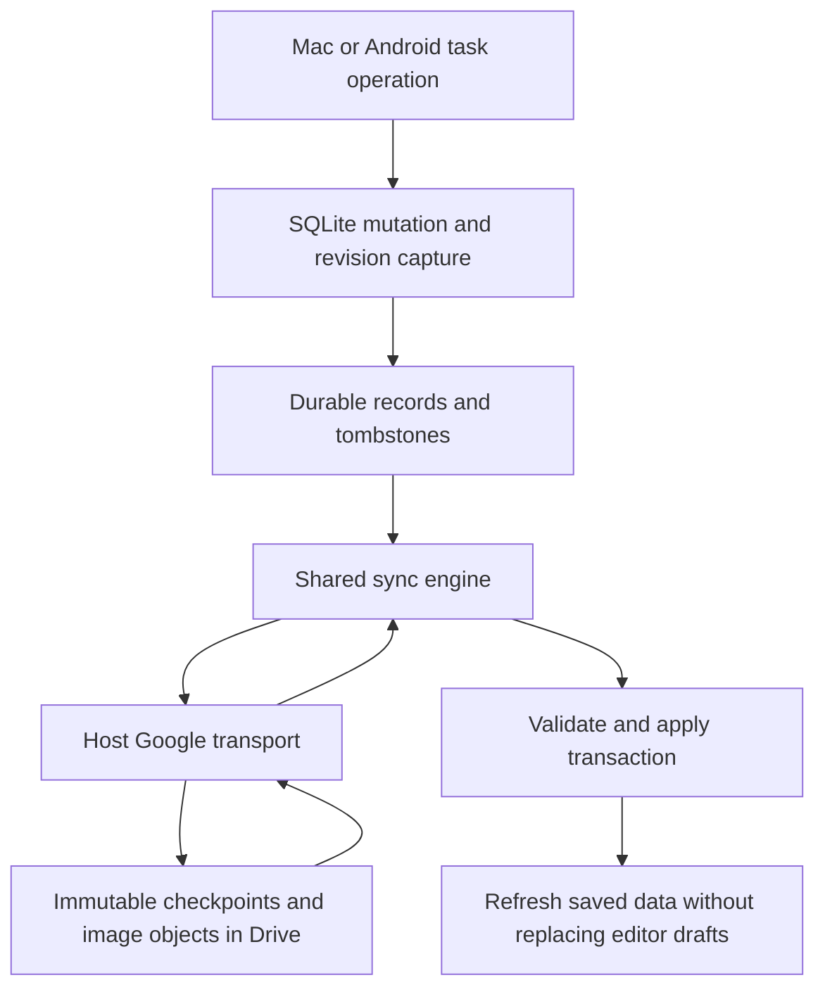
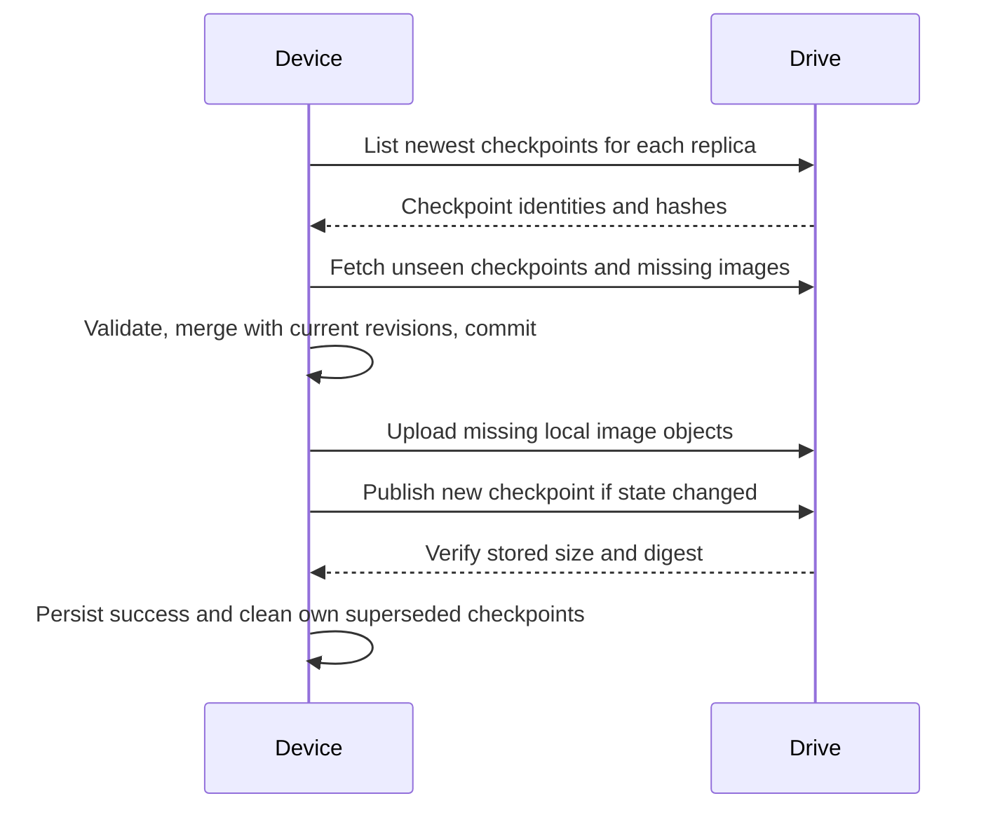
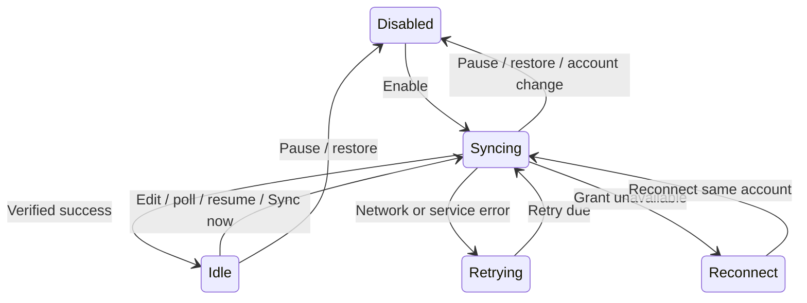

# Google Drive Sync - Plan

## Goal Capsule

**Objective:** The same tasks and lists are available on Mac and Android after either device reconnects.
**Means:** Shared merge logic with device-owned Drive checkpoints (KTD1, KTD2).
**Authority:** The user's current sync decisions supersede the original MVP exclusion in `AGENTS.md` and `docs/scope-decisions.md`.
**Execution:** Implement and verify locally in the existing checkout, preserving unrelated work. Publication is outside this request.
**Stop conditions:** Do not enable a real account until migration, convergence, retry, and restore tests pass. Report a provider incompatibility or a newly discovered destructive ambiguity before proceeding with that part.

---

## Product Contract

### Summary

Sync tasks, lists, ordering, relationships, trash, and managed images through the connected Google Drive account. Both apps remain usable offline. Conflicts resolve automatically, and backups remain a separate recovery feature.

### Problem Frame

Mac and Android currently keep independent SQLite databases. Uploading a backup does not transfer individual edits and cannot reconcile two devices that have both changed.

### Key Decisions

- **Automatic conflict resolution.** Governs R2. (session-settled: user-directed — chosen over keeping both versions for review: the user wants the most recent edit to win automatically.)
- **Foreground Android sync.** Governs R3. (session-settled: user-directed — chosen over periodic background work: the first version syncs while Tasker is open.)

### Requirements

**Shared data**

- R1. Sync all task and list data, including relationships, ordering, trash state, and managed images, within one Google account.
- R2. Concurrent edits to the same task resolve to the most recent recorded edit, with a deterministic tie-break when times are equal.
- R3. Sync automatically on app/service start, after local changes, and periodically while Android is visible or the Mac service is running.
- R4. Offline changes survive restarts and retry automatically when connectivity returns.
- R5. First sync preserves independently created tasks from both devices; matching imported task identities are merged rather than duplicated.

**Recovery and controls**

- R6. Both apps expose Enable sync, Sync now, Pause sync, last successful sync, pending changes, and actionable errors.
- R7. Sync deletion records survive offline devices reconnecting, and remote absence alone never deletes local data.
- R8. Backups remain readable and restorable across the migration; restore pauses sync and explains that resuming will publish restored changes.
- R9. Google credentials, device identity, local UI preferences, undo stacks, and backup settings are not shared as task data.
- R10. Incoming sync never replaces an open editor's draft; existing local short IDs remain stable, and remote application waits for the editor to close.

### Scope Boundaries

No hosting service, subscriptions, shared workspaces, collaborative editing, or Android background worker. Sync does not treat backup files as live state. End-to-end encryption and remote attachment garbage collection are deferred follow-up work.

### Acceptance Examples

- AE1. Covers R2, R4. Both devices change one task offline. After both reconnect, both show the version with the greater revision; retries do not change the result.
- AE2. Covers R5. Two unrelated tasks share a three-character ID. Both survive the merge, with references still pointing to the original task.
- AE3. Covers R1, R7. A device reconnects with an old copy of a purged task. It stays deleted unless a later explicit edit or restoration wins.
- AE4. Covers R8. An older backup is restored while sync is enabled. A safety backup exists, sync pauses, and no restored state is uploaded without resuming.

---

## Planning Contract

### Existing Behavior

`packages/core/src/db.ts` defines seven application tables. Tasks use three-character IDs, lists use their names as keys, and `updated_at` is not maintained by normal writes. Relationship operations can update multiple tasks and both edge tables. The Android bridge uses synchronous native SQLite calls; normal operations live in `packages/core/src/operations/registry.ts`.

Mac restore swaps the database file and rebuilds the registry. Android restore copies tables in one transaction. Both validators currently require the application-table shapes and reject triggers. Migration and backup compatibility must be designed together.

### Key Technical Decisions

- KTD1. **One portable merge engine.** Put wire validation, revision comparison, deterministic projection, and merge rules under `packages/core/src/sync/`. Host adapters own SQLite access, credentials, HTTP, and scheduling. Android runs the engine in its existing WebView while visible, avoiding a second Java implementation.
- KTD2. **Immutable device checkpoints.** Each publication contains the complete known set of winning records and tombstones, without image bytes. A device publishes a new sequence under its own replica identity and never overwrites another device's file. Retain the two newest verified checkpoints per replica; every newer checkpoint subsumes its own earlier state. This avoids a shared mutable-file race without an unbounded operation log. Upload missing image objects before publishing a checkpoint.
- KTD3. **Stable identity behind existing UI keys.** Persist sync identity separately from task short IDs and list names. Seed legacy tasks from their original short ID plus exact creation timestamp; seed legacy lists from their exact name, with a fixed default-list identity. New task and list incarnations receive random identities. List renames preserve identity. Same-name independent lists receive a deterministic display suffix when necessary.
- KTD4. **Revision order.** Stamp each committed logical mutation with a persisted hybrid logical timestamp and replica tie-breaker. Receive advances the local clock; upload time is never edit time. A task body is one register, preserving description and derived metadata together. Lists and relation edges have their own registers. Purge produces tombstones, and a later explicit undo/restore is a new mutation. This implements R2's session-settled automatic policy. Legacy records lacking edit times get a baseline revision with a content-derived tie-break, so historical recency cannot be reconstructed. Equal legacy revisions use canonical payload order as a deterministic exception; real recorded revisions reject differing payloads under the same revision.
- KTD5. **Atomic mutation capture.** Wrap synchronous operation bodies, undo persistence, and sync capture in one SQLite transaction. The current async `$try` wrapper must not become a transaction spanning an await. Capture every row affected by a logical operation, including cascades, inverse markers, edge removals, and bulk reorder. Incoming projection bypasses local change capture. All supported task writes must enter this boundary; image storage alone is not a task mutation.
- KTD6. **Canonical references and projection.** Wire task references use stable identities. Preserve existing local aliases first, then preferred short IDs; allocate remaining collisions deterministically. In the rare collision case, display aliases can differ across devices while stable identities and content converge. Translate only parsed metadata reference tokens, never arbitrary prose, URLs, or code. Build the graph after choosing winners, remove edges to deleted endpoints, and deterministically suppress cycles and invalid cross-list parenting. Rebuild inverse markers from the accepted graph without issuing new revisions. Equal sort ranks use stable identity as the tie-break. If the three-character ID space is exhausted, fail the apply transaction without dropping any record. A surviving task whose list was deleted projects into the default list, preserving the task's winning payload.
- KTD7. **Transactional local application.** Validate all records and attachment manifests before writing. Fetch and validate missing image bytes before accepting a checkpoint. Merge against the latest local revisions inside the apply transaction, so edits made during download survive. Task projections regenerate relationship markers from the merged edge records rather than retaining stale inverse markers in a winning task body. Do not delete image BLOBs as part of this version. Clear incompatible local undo history only when remote data actually changes the projection; a no-op poll keeps undo available.
- KTD8. **Account and restore boundaries.** Enable sync explicitly for the connected account. Pin sync state to Drive's stable account identifier; a changed account pauses rather than automatically uploading data. Store replica identity, enabled state, account and sequence outside portable backups. Pending checkpoint bytes remain in local metadata and are discarded during restore rebasing. After a restore, fork the replica identity, preserve a pre-restore sync baseline, and record the restored difference as fresh revisions before resume. Old backups missing sync metadata are migrated locally. Keep the existing portable seven-table schema and manifest version. Sync metadata is rebuilt and rebased after restore; backup validators continue rejecting executable triggers.
- KTD9. **Bounded Drive transport.** Reuse `drive.file` authorization and identify files with separate sync app properties. Pre-generate and persist a Drive file ID before upload; on an ambiguous response, verify the exact file's digest before marking publication complete. Validate pagination, object type, schema version, size, and SHA-256. Limit each image to the existing 10 MiB allowance and checkpoints to 16 MiB; exceeding a limit leaves local edits intact with an error. Do not follow authenticated redirects to other origins. Google documents pre-generated IDs as a way to make creation retries non-duplicating: [Create and manage files](https://developers.google.com/workspace/drive/api/guides/create-file).
- KTD10. **Serial scheduling and truthful status.** Run one sync job per device, debounce edits, and poll every 30 seconds while eligible. Retry transient failures with bounded exponential backoff. Resume triggers an immediate attempt. Cancellation and generation checks prevent work from a paused/disconnected account being applied later. Last successful sync advances only after pull, apply, and any necessary publication finish. Status distinguishes disabled, idle, syncing, offline/retrying, and reconnect required.

### High-Level Technical Design

### Alternatives

Full database replacement cannot satisfy R2 and R4. A shared mutable JSON file requires concurrency control across devices. An append-only event log requires checkpoint and compaction rules before retention is safe. KTD2 provides complete mergeable state without those mechanisms; the choice follows directly from the single-user, low-volume scope and does not need a separate prototype competition.

### Implementation Risks

Short-ID collision handling and graph projection need explicit adversarial tests. Old records cannot supply historical timestamps they never stored. Drive visibility across the two existing OAuth clients must be proved with an isolated sync namespace before real data is enabled. Device clock errors remain a limitation of automatic time-based resolution; observed remote clocks preserve causal ordering but cannot reconstruct true wall time for disconnected devices.

---

## Implementation Units

### U1. Portable identity, revisions, and merge

**Goal:** Deterministic convergence independent of delivery order.
**Requirements:** R1, R2, R5, R7; KTD1-KTD4, KTD6.
**Dependencies:** None.
**Files:** New `packages/core/src/sync/{types,validation,merge,projection}.ts`, `packages/core/tests/sync/{merge,projection}.test.ts`; package exports.
**Approach:** Specify the versioned checkpoint and attachment manifest format, canonical serialization, clock rules, and identity mapping before transport.
**Test scenarios:**

- AE1: reversed delivery, repeated delivery, equal timestamps, local clock rollback, and three replicas converge.
- AE2: collisions preserve both tasks and resolve parsed forward/inverse references correctly.
- AE3: purge and stale offline updates obey revision order.
- Concurrent list rename, rename collision, delete/recreate, reordering, edge add/remove, cycles, and missing endpoints project consistently.
- Unknown versions, oversized strings, duplicate identity/revision with different bodies, and invalid image references reject without partial merge.

**Verification:** Pure isolated tests prove associativity, commutativity, idempotence, and graph invariants over generated operation permutations.

### U2. Persistence, mutation capture, and backup migration

**Goal:** Every supported local edit is durably syncable, including after a crash or restore.
**Requirements:** R4, R5, R7-R9; KTD3-KTD8.
**Dependencies:** U1.
**Files:** New `packages/core/src/sync/store.ts`, `packages/core/tests/sync/store.test.ts`; `packages/core/src/operations/{registry,try}.ts`, operation handlers, database factories; `apps/android/src/database.ts`, native `TaskerDatabase.java` and `BackupStore.java`; `apps/macos/src/backup/manager.ts`; existing backup and operation tests.
**Approach:** Add metadata tables without widening the public task ID. Introduce a synchronous transactional operation hook. Preserve migration safety backups and keep the existing portable backup format; derive sync metadata separately.
**Test scenarios:**

- Failed mutation, failed capture, and process interruption commit neither half of a task/revision pair.
- All create/edit/status/move/reorder/trash/purge/list and undo/redo channels capture their full affected set.
- A legacy database migrates twice without duplicate identities or lost BLOBs.
- AE4: both hosts restore old/new backups, pause sync, preserve safety data, and generate a fresh restore mutation set on resume.
- Incoming no-op leaves undo intact; actual remote change invalidates stale commands.

**Verification:** Core integration tests and Android instrumentation use temporary databases, with rollback injection and no real accounts.

### U3. Drive transport and shared sync coordinator

**Goal:** Exchange verified checkpoints without overwrites or stuck progress.
**Requirements:** R1-R4, R6, R7, R9; KTD2, KTD7-KTD10.
**Dependencies:** U1, U2.
**Files:** New `packages/core/src/sync/coordinator.ts`, `packages/core/tests/sync/coordinator.test.ts`, shared `packages/core/src/sync/drive.ts` and `packages/core/tests/sync/drive.test.ts`; Android native `SyncHttp.java`, `SyncDatabaseTest.java`; authorization adapters.
**Approach:** Inject transport and attachment storage into the coordinator. Expose bounded native async requests on Android, retaining tokens in native code. Keep backup retention queries isolated from sync files.
**Test scenarios:**

- Simultaneous publication by two replicas loses no checkpoint.
- Timeout after server acceptance retries the same ID and verifies its digest.
- Missing/corrupt attachment, pagination cycles, quota errors, 401, interrupted download, and unknown protocol preserve local state and pending changes.
- An edit during download wins against an older incoming record.
- Pause/disconnect during each phase prevents later apply; success and failure both clear busy state.
- Retention never deletes another replica's files or backup snapshots.

**Verification:** Fake HTTP and in-memory transport tests prove all failure paths without contacting Google.

### U4. Mac and Android lifecycle integration

**Goal:** Automatic sync follows the agreed device lifecycle.
**Requirements:** R3, R4, R6, R9, R10; KTD1, KTD8, KTD10.
**Dependencies:** U3.
**Files:** `apps/macos/src/service/server.ts`, new Mac `sync/coordinator.ts`, `apps/macos/tests/service.test.ts`; `apps/android/src/host.ts`, `apps/android/src/database.ts`, `apps/android/src/main.tsx`, new `sync.ts`, native `MainActivity.java`; `packages/core/tests/sync/coordinator.test.ts` and native `SyncDatabaseTest.java`.
**Approach:** Reuse the existing Google connection rather than creating competing grants. Connect database change notifications and lifecycle events to the shared scheduler. Quiesce sync for restore and service shutdown.
**Test scenarios:**

- Android starts, hides, resumes, and restarts with pending edits; only visible sessions start new work.
- Mac polls while its popover is closed and stops cleanly at service shutdown.
- Wrong-account reconnect pauses before any data publication.
- Successful remote apply refreshes task lists while preserving an open editor draft and current selection where possible.

**Verification:** Isolated service and native lifecycle tests plus real-host checks after U5.

### U5. Shared sync controls

**Goal:** Users can see and control synchronization on both hosts.
**Requirements:** R6, R8-R10.
**Dependencies:** U4.
**Files:** New `packages/ui/src/components/SyncPanel.tsx`; host entry screens, shared help panel, UI exports; new `apps/macos/tests/e2e/sync.spec.ts` and isolated fixtures.
**Approach:** Add View sync beside existing backup controls, respecting desktop top controls and Android bottom controls. Reuse the transparent SVG Google logo. Enable explains that both devices' tasks will be combined. Pause keeps local data. Restore copy explains R8 before the existing restore confirmation.
**Test scenarios:**

- Disabled, pending, syncing, up-to-date, retry, reconnect, and paused states render on desktop/mobile.
- Sync now stays busy only for the active job, including after a rejection.
- Polling does not race a manual action or leave stale success labels.
- Keyboard, touch targets, long list names, and an open task editor retain existing behavior.

**Verification:** WebKit scenarios use fake hosts; inspect actual Android and SwiftBar separately.

### U6. Device verification and documentation

**Goal:** Verify the complete path on both real hosts before enabling normal use.
**Requirements:** R1-R10.
**Dependencies:** U5.
**Files:** `docs/scope-decisions.md`, `docs/implementation-status.md`, `apps/android/README.md`, `README.md`; cross-device integration tests.
**Approach:** First prove OAuth-client visibility and bidirectional exchange with isolated synthetic data and a separate Drive namespace. Then create safety backups on both hosts and verify initial merge. Preserve existing configuration and use APK replacement without clearing app data.
**Test scenarios:**

- Mac-to-phone and phone-to-Mac task, image, rename, reorder, relationship, trash, and purge round trips.
- AE1 on actual hosts with connectivity interrupted; reconnect in both orders.
- Restart both apps after a pending upload and after a remote apply.
- Keep an editor open through an ID collision and verify its save still edits the original task.
- Verify restored old backups remain usable and cannot silently roll back the other device.

**Verification:** Record commands, counts, host evidence, and unresolved limitations in the implementation status document, never credentials or user database content.

---

## Verification Contract

Run `pnpm build` before consumers, then `pnpm test`, `pnpm typecheck`, and `pnpm test:e2e` against isolated data. Android native changes require debug build, instrumentation tests, and lint. No service test may use real Keychain grants; use a unique dummy OAuth override. Browser results do not prove native lifecycle behavior. Production account testing follows the isolated gates in U6. No release tagging or publication is part of this task.

---

## Definition of Done

Both installed apps exchange offline changes and managed images under R1-R10. All unit-level scenarios and host gates pass. The first merge has safety backups, does not lose independent tasks, and reports a verified success. Supported legacy backups still restore. No credentials, task databases, downloaded backups, or abandoned experimental code enter tracked changes. Implementation evidence records any real-host limitation explicitly.

## Execution notes

Implemented in the current checkout. The shared Drive protocol owns validation, checkpoint publication and attachment transfer; host HTTP adapters only supply existing authorization and bounded native transport. Editor protection defers remote application and preserves existing local aliases. Verification evidence and remaining host limitations are recorded in `docs/implementation-status.md`.
