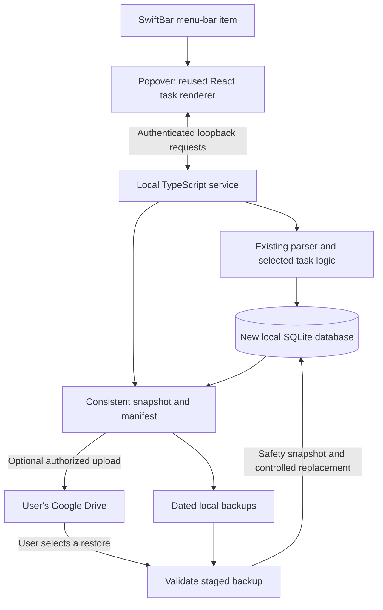

# SwiftBar Tasker MVP - Plan

## Goal Capsule

**Objective:** Manage everyday tasks from the Mac menu bar, with reliable recovery from local and Google Drive backups, on a $0 project budget.

**Means:** A SwiftBar popover hosting the existing task-rendering logic, the existing TypeScript task parser, local SQLite storage, and optional Google Drive backup uploads.

**Repository:** Develop a pnpm monorepo separately from cli-tasker. A new repository is recommended; its final name, local location, and remote visibility remain to be chosen. `tasker-swiftbar` is a working name. This document is a draft stored outside the source repository and should move into the new repository's `docs/plans/` when it exists.

**Authority:** The user's scope controls this plan. Implementation is not authorized by drafting it. Do not change the original application, connect accounts, create paid services, or publish a repository as part of planning.

**Boundaries:** macOS only for the MVP. Future mobile means Android. No mobile implementation, Supabase, CalDAV, or multi-device synchronization in this work.

---

## Product Contract

### Summary

Build a smaller, separate task application while preserving the existing parser and rendering logic. A left click opens the reused task interface in SwiftBar's popover; a right click opens utilities. Tasks remain usable offline. Users can connect Google Drive for dated backups and explicitly restore a selected backup.

### Problem Frame

The current application carries more desktop and synchronization infrastructure than this MVP needs. The useful task syntax should survive without bringing the existing Electron and cloud architecture into the replacement.

### Requirements

**Repository and budget**

- R1. All implementation lives in a new repository or a fork, separate from the original cli-tasker checkout, organized as a pnpm monorepo with the Mac app and shared core and renderer packages. The recommended draft direction is a new repository with selected source copied in and its origin recorded.
- R2. The MVP requires no paid hosting, domain, subscription, developer membership, or increased storage allowance. Exhausted cloud quotas pause backups and surface an error; they must not trigger purchases.

**Task experience**

- R3. The Mac interface uses SwiftBar and a popover, following data-usage's interaction pattern. Adding, editing, and changing status happen inside the main view.
- R4. Reuse the existing task-description, date, and search parsers with their tests. Preserve contiguous metadata-only trailing lines, priorities, dates, tags, and relationship markers, including display stripping and metadata write-back.
- R5. Provide task creation and editing, Pending/In Progress/Done/Won't Do, lists, search, trash/restore, and undo for local task mutations. Keep relationship input and validation through the existing syntax; a graphical relationship editor is deferred.
- R6. Store all task data locally and support normal task operations without Google authorization or an internet connection. Edits and status changes must not unexpectedly reorder visible tasks.
- R13. Preserve the existing desktop rendering logic: task titles and descriptions, Markdown and interactive checkboxes, media previews, status/priority/date/tag presentation, relationship badges, and list rendering. Reuse the React components, display helpers, styling, and relevant tests; adapt host dependencies for SwiftBar without replacing the renderer with a simplified implementation.

**Backup and recovery**

- R7. Create consistent, dated local backups automatically and through “Back up now.” Draft defaults are one automatic backup per day while running, keeping seven successful daily backups; user-created backups are retained until explicitly removed.
- R8. Let users connect their Google account and authorize access to app-created Drive files. Upload completed local snapshots into an app-created backup folder and report the last successful cloud backup separately from the last local backup.
- R9. Support browsing available backups and explicitly restoring one after previewing its date and replacement effect. Verify the backup first and create a local safety snapshot before replacing current task data.
- R10. A backup is a recovery snapshot. The application must not watch Drive files to merge tasks or silently replace its database with a remote version.
- R11. Cloud failures must not block local task operations. Disconnecting Google stops uploads and removes locally held authorization credentials without deleting local tasks or existing Drive backups.

**Future compatibility**

- R12. Keep parser logic and the backup data format independent of macOS. Future Android support must be possible without reverse-engineering Mac paths or Keychain contents; no Android code is required now.

### Key Decisions

- **Build our own application.** Tasks.org is a reference for setup and backup patterns, not an application or cloud dependency. Governs R1, R8. (session-settled: user-directed — chosen over using Tasks.org as our client: the user explicitly wants our own application.)
- **Ship only the Mac app and backups.** Governs R3, R7–R12. (session-settled: user-directed — chosen over planning mobile and synchronization now: the MVP must stay small and cost $0.)

### Scope Boundaries

No account system of our own, hosted backend, subscription billing, multi-device merge, CalDAV client/server, Google Tasks integration, Microsoft To Do integration, or Tasks.org integration.

Android, a browser-hosted product, drag-and-drop polish, notification integrations, and advanced relationship visualization are follow-up work. SQLite identifiers do not need a distributed identity migration for this MVP.

### Acceptance Examples

- AE1. With networking disabled, create a task whose final line contains priority, date, and tag metadata. Close and reopen the popover; the task and parsed values persist. Covers R3–R6.
- AE2. After a successful local snapshot, a revoked Google token causes a visible cloud-backup error while task editing remains available. Reconnecting permits retry. Covers R7, R8, R11.
- AE3. Select an older backup, review the replacement warning, and restore it. Its tasks return; a safety snapshot can recover the pre-restore state. Covers R9, R10.
- AE4. Install the new application alongside cli-tasker. Creating and restoring tasks in the new application changes neither the original database nor the original plugin/app. Covers R1, R6, R9.

---

## Planning Contract

### Assumptions to Review

The draft proposes a new repository rather than a GitHub fork, reuse of selected TypeScript core logic rather than a language rewrite, and the task features listed in R5. These are recommendations, not previously approved feature commitments. Preserving both parser and rendering logic is an explicit user requirement, covered by R4 and R13.

Distribution initially uses source installation with documented free prerequisites, including SwiftBar and a supported Node runtime. A paid Apple signing/notarization workflow is outside the budget. Shipping a bundled runtime can be evaluated later.

### Key Technical Decisions

- KTD1. **Copy the reusable core and renderer into the new repository.** Start with parsers, task types, required queries, undo behavior, React rendering components, display helpers, styles, and relevant tests. Do not depend on the original checkout at runtime or copy the whole Electron/mobile workspace. Preserve source notices and record the source revision; verify redistribution terms before public release.
- KTD2. **Prove the writable popover first.** data-usage generates a local HTML page and uses SwiftBar's `webview=true` action. It does not demonstrate task mutations from that page. Prototype a popover served by a local Node service with the UI and API on the same loopback origin. Whether the installed SwiftBar build permits this and retains usable focus must be established before building the full UI.
- KTD3. **One local service owns writes.** The service calls the TypeScript task engine and owns the new SQLite database, backup scheduler, and Google authorization adapter. SwiftBar supplies the menu-bar shell. A per-user launch agent manages service lifetime; plugin refreshes must not spawn competing servers. The installer uses a distinct app-data directory and plugin identity.
- KTD4. **Keep the local API private.** Bind only to loopback. Use an unguessable per-install bootstrap credential, authenticated UI requests, exact Host/Origin checks, and no wildcard CORS. Do not put Google tokens in the page or logs. Render task content safely and accept structured task actions rather than shell commands. Verify the bootstrap in U1; loopback alone is not authentication.
- KTD5. **Use SQLite-aware snapshots and a versioned manifest.** All managed image bytes live in the same SQLite database as tasks, so a consistent database snapshot contains both. No separate media directory needs backing up. Include a manifest with format version, schema version, creation time, app version, and snapshot checksum. Use a supported online-backup facility or SQLite snapshot operation verified against the selected driver. Do not rely on checkpoint-then-file-copy while another writer might run. Exclude OAuth credentials, machine-specific configuration, and transient service state; existing user-authored file paths remain description content, not portable attachments.
- KTD6. **Google Drive is optional storage.** Use the narrow `drive.file` scope and an app-created visible backup folder. Keep its file/folder identifiers in account-scoped local configuration. Reconnect must discover the app's existing folder rather than create duplicates. OAuth runs in the system browser using the desktop installed-app flow with PKCE and state validation; refresh credentials live in macOS Keychain. The UI labels this connection “Google Drive backups,” not device sync.
- KTD7. **Make upload retries and retention safe.** Give each snapshot a stable backup ID and find/reuse an existing upload after an ambiguous response. Keep seven completed automatic cloud backups by default, independently of local retention. Prune only the app's identified automatic backups after a replacement is confirmed; preserve manual and pre-restore snapshots. Retry temporary failures with bounded backoff. Expired consent and full storage require visible user action.
- KTD8. **Restore while writes are paused.** Download to staging, validate manifest/checksum/schema and database integrity, then create the safety snapshot. Close database handles, activate the validated replacement, reopen, and refresh the UI. Keep the old database until successful reopening and make interruption recovery deterministic. A restore failure must leave a usable old database. Restores never reconnect an account from backup contents.
- KTD9. **Keep React rendering behind a host adapter.** Carry over `TaskItem`, `MarkdownContent`, `ListSection`, `task-display`, their editor hooks, store behavior, shadcn components, sortable wrappers, and required styles. Replace direct `window.ipc`, Electron popup events, external-link handling, clipboard operations, and `local-file://` media resolution with explicit adapter capabilities. Retain display behavior and source-line-aware Markdown checkbox mutations. AI-decomposition calls are not rendering logic and remain outside this MVP. Local media access must be limited to user-authorized resources, not an arbitrary-path HTTP endpoint. Pasted images become local managed attachments with no Supabase upload; KTD5 includes them in backups. External URLs and arbitrary linked files are not automatically archived, and missing resources retain the renderer's fallback behavior. Imported Supabase image URLs remain external references unless their bytes are explicitly imported.
- KTD10. **Store managed images as SQLite BLOBs.** User-selected storage direction: preserve the original encoded image bytes (PNG, JPEG, etc.) in an `attachments` table with a stable ID, MIME type, byte length, and creation time. Avoid base64 storage and its roughly one-third size overhead. Descriptions contain a portable attachment reference, never the bytes or a machine path. The renderer's media adapter resolves this reference to an authenticated local resource URL before normal Markdown URL handling; a future Android client can resolve the same ID from SQLite using its own image loader. Keep ordinary task queries free of BLOB payloads and load images on demand. Preserve referenced images across edits, trash and undo/redo; defer automatic attachment garbage collection in the MVP. Document and enforce a per-image size limit. Full snapshot upload size grows with image content; this remains backup, not incremental device sync.

### High-Level Technical Design



### Monorepo Layout and Dependencies

Use pnpm workspaces with one lockfile and root build/test/typecheck scripts. No additional monorepo build orchestrator is required for the MVP.

```text
apps/
  macos/
    plugin/             # SwiftBar entry point
    src/service/        # Local API, database ownership and process lifecycle
    src/ui/             # Popover entry point and Mac host adapter
    src/backup/         # Snapshot, restore and upload scheduling
    src/google/         # Drive, desktop OAuth and Keychain integration
    scripts/            # Install/uninstall and launch-agent setup
    tests/              # Service, backup, integration and popover tests
packages/
  core/
    src/                # Parsers, types, task queries, SQLite schema and undo
    tests/              # Parser, query, storage and undo coverage
  ui/
    src/                # Reused React renderer, editor hooks and styles
    tests/              # Display, editing and rendering coverage
docs/
pnpm-workspace.yaml
package.json
pnpm-lock.yaml
```

These are paths in the future repository, not additions to cli-tasker. The Mac app consumes both shared packages. The UI consumes only browser-safe core exports (types, parsers and display-related pure logic); database drivers and Node APIs stay outside its dependency graph. Core exposes its SQLite/Node functionality separately from those pure entry points. UI service and host capabilities are injected through interfaces rather than importing the Mac app or reading `window.ipc`.

Keep backup and Google integration within the Mac app until another implemented client needs them. Future Android can join under `apps/android/`, but create no placeholder app now. Pure TypeScript is reusable with a compatible runtime; a native Kotlin client would need a port or bridge. React DOM components are not directly reusable as native Android views. Preserve the portable schema, attachment IDs and behavior fixtures without selecting an Android UI/runtime now.

### Evidence and Constraints

#### Parsing and rendering source audit

This is source inspection, not a compatibility result. No builds or tests were run during planning.

| Layer | Existing implementation and behavior to retain | Extraction boundary |
| --- | --- | --- |
| Parser | `task-description-parser.ts`: `parse`, `getDisplayDescription`, and `syncMetadataToDescription`; date and search parsers | Reuse the pure TypeScript functions and tests. Metadata can occupy multiple contiguous trailing lines; a single metadata-only description remains visible. |
| Task mutations | `queries/task-queries.ts`, notably `renameTask`; desktop `electron/ipc/tasks/main.ts` | Carry over query semantics and undo recording. Unchanged relative-date markers retain the stored date, and relationship changes update other tasks. Copying parser functions alone loses these behaviors. |
| Task presentation | `task-display.ts`, `TaskItem`, `ListSection`, `MarkdownContent`, shadcn components and styles | Preserve a plain-text first-line title and Markdown body, hidden metadata, badges, nested lists, interactive checkboxes, code copy, media previews and preview state. YouTube previews open externally; they are not embedded players. |
| Editing | `use-metadata-autocomplete`, `use-markdown-shortcuts`, `content-editable-utils` | Preserve live caret/selection logic, autocomplete cancellation and keyboard precedence. The DOM writer explicitly builds Chrome-style multiline markup, so WebKit behavior needs proof. Underline uses raw `<u>` markup; HTML sanitization must retain supported formatting. |
| View state | `use-tasker-store`, service wrappers, `app.tsx`, sortable components | Preserve relationship-summary loading, in-place status/badge updates and stable ordering. Replace IPC refresh events and popup lifecycle handling. Keep supported ordering behavior; no new drag-and-drop features are required. |
| Host integration | Electron clipboard/window handlers, `local-file` protocol, popup layout | Clipboard image saving currently tries Supabase first, then a sibling `media/` directory. The 400px interface also relies on 200px of transparent window overflow for submenus. Replace these host mechanisms and fit menus within the popover. |

The reusable renderer therefore includes editing and state behavior, not just three visual components. Do not copy the Electron application root wholesale. The first prototype should use these existing modules with fixture data, making the host-sensitive behavior visible before committing to the rest of the extraction.

Existing tests are useful fixtures, but the Electron test harness is not portable as-is. In `e2e/markdown.spec.ts`, the checkbox test clicks an icon and checks that its label remains visible; it does not prove the changed source was persisted. Media tests assert elements and URLs, not successful playback. Strengthen those assertions during extraction, and exercise clipboard, focus and local media in the actual host.

- cli-tasker's `packages/core/src/parsers/` already separates parsing from Electron. Its package exports include a parser entry point.
- `packages/core/src/db-node.ts` enables WAL. `packages/core/src/backup/backup-manager.ts` currently checkpoints and copies the database; KTD5 replaces that backup mechanism in the new project.
- Existing `packages/core/tests/parsers/`, query tests, and undo tests provide reusable behavioral coverage. Source code takes precedence over older reference documents, some of which still describe C#.
- Desktop `src/components/TaskItem.tsx`, `MarkdownContent.tsx`, `ListSection.tsx`, `src/lib/task-display.ts`, and `src/styles.css` supply the rendering implementation to preserve. `MarkdownContent` currently uses Electron-specific local-media resolution, and task components call IPC directly; these need adapters, not a fresh renderer. Port `tests/task-display.test.ts` and applicable Markdown, metadata-autocomplete, and task-flow E2E scenarios to the new service-backed test harness.
- data-usage's `src/render.rs` opens the web popover from the title line and puts write actions in the right-click menu. `src/report.rs` generates the HTML. This is an interface reference, not proof of KTD2's service bridge.
- Preserve the lessons in cli-tasker's relative-date, task-ordering, and test-isolation solution documents: unchanged relative-date markers must not shift due dates during an unrelated edit; tasks must remain stable during interaction; all tests use isolated data.

### Budget and Setup

No server is hosted on our behalf. The local service runs on the user's Mac; backup storage uses the user's existing Drive allowance. Google API use must remain within included quotas, and the application must work with cloud uploads disabled.

Google integration still requires a developer-owned Cloud project, Drive API enablement, an appropriately configured desktop OAuth client, and consent-screen setup. Before external distribution, verify current publishing requirements and token longevity for the intended audience. Do not leave ordinary users dependent on short-lived testing-mode grants. Any requirement for paid services or a paid domain must return as a budget conflict, not be silently introduced.

### Open Questions and Execution Gates

1. **Before repository creation:** choose the final name, local destination, remote owner/visibility, and confirm new repository versus fork. The draft recommends a new repository.
2. **Before building the full interface:** U1 must prove the authenticated service bridge, input focus, and reopen behavior inside actual SwiftBar. If it fails, revise this plan rather than silently switching to Electron or a native Swift app.
3. **Before releasing Google backup:** complete and verify the no-cost OAuth configuration in U5. Local development can proceed against test adapters first.

---

## Implementation Units

### U1. Establish the separate repository and prove the popover

**Goal:** Validate the central interface with a disposable task database. **Requirements:** R1–R3, R6. **Dependencies:** repository choice above.

**Files:** proposed root workspace manifests, `apps/macos/plugin/Tasker.1m.sh`, `apps/macos/src/service/server.ts`, `apps/macos/src/ui/index.html`, `apps/macos/tests/popover.spec.ts`, `apps/macos/tests/service-security.test.ts`, and `docs/swiftbar-compatibility.md`.

**Approach:** Follow data-usage's title-action and context-menu split. Use an extracted existing task row, Markdown renderer and contentEditable editor with a fixture task to prove the authenticated loopback bridge and mutations. Include existing autocomplete and Markdown-shortcut hooks. Record the tested SwiftBar and macOS versions, service startup behavior, and any host restrictions. Use KTD2–KTD4 and KTD9.

**Test scenarios:**

- Text input, multiline editing, and a status action work without opening a terminal.
- Newlines, blank lines, selection, caret restoration, autocomplete, and Markdown shortcuts preserve their behavior in WebKit and actual SwiftBar.
- Nested context menus fit within the popover; clipboard paste/copy, local image loading, and representative video playback work through the adapter.
- Closing and reopening the popover preserves committed changes and handles an unfinished draft deliberately.
- A stopped service produces a recoverable startup/error state; repeated plugin refreshes do not create extra listeners.
- Requests without authentication, from another web origin, or with an unexpected Host are rejected.

**Verification:** Browser tests cover the page and service, and a repeatable macOS host check proves actual SwiftBar behavior against temporary data. Browser tests alone do not establish host compatibility.

### U2. Extract local task behavior and safe storage

**Goal:** Reuse the parser and selected task operations in the new application. **Requirements:** R4–R6, R12. **Dependencies:** U1.

**Files:** proposed `packages/core/src/`, `apps/macos/src/service/tasks.ts`, `packages/core/tests/parsers/`, `packages/core/tests/tasks.test.ts`, `packages/core/tests/storage.test.ts`, and `docs/source-provenance.md`.

**Approach:** Bring over the existing parser tests before changing adapters. Extract parsing, display stripping, metadata write-back, query mutations and the desktop handlers' undo recording together. Give the application its own database path. Keep platform APIs outside core. Retain current identifiers and relationship semantics; no sync identity migration is needed. Add optional explicit import from a selected cli-tasker snapshot, without opening the original live database for writes.

Add the attachment table and byte-storage operations from KTD10 to the new schema. Persist image bytes before publishing a description reference, so a failed image save cannot create a broken reference. Image import is explicit; copying a description containing an external URL or file path does not import its contents.

**Test scenarios:**

- Priority, dates, tags, relationship markers, multiline text, and search match the source parser's behavior.
- Renaming on a later day preserves a due date when the relative marker was unchanged.
- Invalid references and ID collisions fail safely; status changes and ordinary edits preserve ordering.
- Import preserves supported task/list/relationship data and reports unsupported fields instead of silently discarding them.
- Database initialization and import under test cannot fall back to either application's production path.

**Verification:** The selected source tests and new storage tests pass against isolated databases; import leaves the source snapshot unchanged.

### U3. Adapt the existing task renderer to the popover

**Goal:** Preserve the existing rendering behavior inside the SwiftBar popover. **Requirements:** R3–R6, R13. **Dependencies:** U1, U2.

**Files:** proposed `packages/ui/src/components/`, `packages/ui/src/lib/task-display.ts`, `packages/ui/src/host.ts`, `packages/ui/src/styles.css`, `apps/macos/src/ui/host-adapter.ts`, `apps/macos/src/service/tasks.ts`, `packages/ui/tests/task-display.test.ts`, `packages/ui/tests/markdown.spec.ts`, `packages/ui/tests/rendering-parity.spec.ts`, `apps/macos/tests/task-flows.spec.ts`, `apps/macos/tests/task-content-security.spec.ts`.

**Approach:** Port the rendering modules identified in KTD9 and replace their host bindings. Retain the existing metadata, Markdown, list, and task presentation while fitting it into the popover. Connect quick capture, editing, lists, search, status controls, trash, and undo to the local service. Display parser errors inline and preserve drafts after failed saves. Keep the right-click menu focused on opening settings, backups, and utilities.

**Test scenarios:**

- Covers AE1. Create, edit, search, change status, undo, trash, and restore with network disabled.
- Long descriptions, empty lists, keyboard navigation, and light/dark appearance remain usable in the popover.
- Shared fixtures preserve title/body separation, Markdown formatting, code blocks, checkbox-to-source-line mapping, media preview controls, date/priority/tag formatting, relationship status badges, and list presentation across the source and new renderer.
- Checkbox tests reload stored descriptions and assert the exact changed line, including duplicate labels, leading blank lines, nested lists, and trailing metadata. Status changes update linked-task badges without moving rows.
- Local and remote media, missing files, external links, and clipboard actions exercise the host adapter without Electron globals. Test representative media in actual SwiftBar; browser-engine differences must be reported rather than hidden by silently dropping rendering features.
- A pasted image renders through its stable attachment reference after reopening. Task-list responses omit image bytes, and image reads require the same authorization as task reads. Undo/redo and trash/restore preserve the image; oversized or failed image saves report an error without inserting a broken reference.
- Service validation failures preserve text and explain what to fix.
- Task descriptions containing HTML, script-like text, or links cannot execute code or invoke local mutations.
- Safe raw formatting, including the editor's `<u>` output, remains supported; sanitization does not silently remove existing formatting features.

**Verification:** Playwright tests pass against the real local service with temporary databases; repeat the U1 host checks on the completed interface.

### U4. Add local backups and controlled restore

**Goal:** Prove recoverability before adding cloud storage. **Requirements:** R7, R9–R12. **Dependencies:** U2, U3.

**Files:** proposed `apps/macos/src/backup/snapshot.ts`, `apps/macos/src/backup/manifest.ts`, `apps/macos/src/backup/restore.ts`, `apps/macos/tests/backup.test.ts`, `apps/macos/tests/restore.test.ts`, `apps/macos/tests/backup-ui.spec.ts`.

**Approach:** Implement KTD5 and KTD8. Run a due automatic backup on service start and daily while awake; do not wake the Mac to back up. Keep local success timestamps separate from any future upload state.

**Test scenarios:**

- A snapshot taken during task activity reopens consistently with valid relationships.
- Pasted images survive restoration into a different app-data directory using only the database snapshot and manifest. Verify byte-for-byte BLOB contents and attachment references after restore, including images retained for trash and undo. There is no separate media-file activation step.
- Daily retention never deletes manual or safety backups; a failed snapshot never replaces a good one.
- Covers AE3. Restore requires explicit confirmation and can recover the previous state from its safety snapshot.
- Corrupted, unsupported-newer-schema, truncated, or maliciously packaged backups are rejected before replacing data.
- Inject interruption at each restore boundary and verify recovery uses a complete old or new database.

**Verification:** Automated restore tests prove both successful replacement and failure recovery, including process restart, without production data.

### U5. Connect Google Drive and upload backups

**Goal:** Add cloud recovery without a hosted backend. **Requirements:** R2, R8–R12. **Dependencies:** U4 and no-cost OAuth setup.

**Files:** proposed `apps/macos/src/google/oauth.ts`, `apps/macos/src/google/drive.ts`, `apps/macos/src/google/credentials.ts`, `apps/macos/src/backup/uploads.ts`, `apps/macos/tests/google-auth.test.ts`, `apps/macos/tests/drive-backup.test.ts`, `apps/macos/tests/cloud-backup-ui.spec.ts`.

**Approach:** Implement KTD6–KTD7. Reuse the local restore validation pipeline for downloaded files. Show local/cloud backup times, actionable errors, reconnect, and disconnect. Study Tasks.org for reference only; there is no runtime dependency on it.

**Test scenarios:**

- Covers AE2. Denied consent, revoked tokens, temporary network failure, and full Drive storage leave local task operations working.
- OAuth rejects an invalid state; credentials never appear in snapshots, URLs exposed to the UI, or logs.
- A timed-out upload followed by retry creates one logical backup; reconnect finds prior backups.
- Retention cannot delete unrelated Drive files, manual backups, or the last good automatic backup after a failed upload.
- A cloud backup downloaded on a fresh installation restores without credentials or paths from the original Mac.

**Verification:** Deterministic tests use fake OAuth/Drive endpoints. An opt-in developer-account check verifies real consent, upload, discovery, download, and revocation using disposable backup data.

### U6. Package, document, and verify coexistence

**Goal:** Install and operate the MVP independently for $0. **Requirements:** R1, R2, R6–R12. **Dependencies:** U3–U5.

**Files:** proposed `apps/macos/scripts/install.sh`, `apps/macos/scripts/uninstall.sh`, `apps/macos/plugin/`, `README.md`, `docs/backups.md`, `docs/architecture.md`, `apps/macos/tests/install-smoke.sh`, `apps/macos/tests/coexistence.test.ts`.

**Approach:** Document and install the free runtime prerequisites, the per-user service, and the SwiftBar plugin. Pin supported versions. Keep service credentials and private runtime files permission-restricted. Uninstall stops the service and removes integration files while retaining task data and backups by default.

**Test scenarios:**

- Covers AE4. Install, upgrade, and uninstall do not modify cli-tasker's files, database, or startup configuration.
- Login/restart and sleep/wake recover the service without duplicate listeners or missed-daily-backup loops.
- Missing prerequisites produce useful guidance; failed updates retain a runnable installation.
- An account-free installation works offline, and a connected installation reports the actual backup state after restart.

**Verification:** Repeatable installation smoke checks pass on a clean supported Mac environment with isolated data; the documented setup requires no paid resources.

---

## Verification Contract

The monorepo root must define `pnpm test`, `pnpm typecheck`, `pnpm build`, and `pnpm test:e2e`, delegating to the workspace packages in dependency order. Rebuild extracted core before testing consumers. Verify the UI bundle contains no Node/SQLite driver imports and the shared packages do not depend on `apps/macos`. Add an explicit opt-in host-smoke target; do not present browser emulation as a SwiftBar integration pass.

All automated tests use temporary app-data directories, fake credentials, and isolated endpoints. Missing test paths must fail closed. No tests touch the user's Drive or current task database. Real-provider checks require a dedicated developer test account and disposable data.

Review the finished plan for scope, feasibility, backup safety, and consistency before implementation. U1 and the OAuth setup remain explicit execution gates, not completed validations.

---

## Definition of Done

- The new repository contains the Mac application, its selected reusable task logic, source provenance, and repeatable tests.
- R1–R13 and AE1–AE4 are demonstrated within the MVP scope.
- The original parser and rendering logic are preserved, with host adapters and parity tests covering the SwiftBar transition.
- Creating and editing tasks inside actual SwiftBar works offline.
- Local and Drive backups can be restored, and failed restores preserve recoverable data.
- Installation and regular operation require no paid services or developer memberships.
- cli-tasker remains independently runnable with its original data untouched.
- No mobile, Supabase, CalDAV, or multi-device sync implementation is included.
- Experimental code from rejected approaches is removed; setup, backup limits, and recovery behavior are documented.

---

## Sources

- cli-tasker: `packages/core/src/parsers/`, `packages/core/src/db-node.ts`, `packages/core/src/backup/backup-manager.ts`, query/undo modules, and their tests. These are source-reference paths, not target-repository paths.
- cli-tasker renderer: `apps/desktop/src/components/TaskItem.tsx`, `apps/desktop/src/components/MarkdownContent.tsx`, `apps/desktop/src/components/ListSection.tsx`, `apps/desktop/src/lib/task-display.ts`, `apps/desktop/src/styles.css`, `apps/desktop/tests/task-display.test.ts`, and `apps/desktop/e2e/`.
- data-usage: `src/render.rs`, `src/report.rs`, `src/report.html`, and `plugin/Data Usage.2s.sh` in that reference repository.
- [SwiftBar plugin API](https://github.com/swiftbar/SwiftBar#plugin-api): webview actions, plugin output, and refresh behavior.
- [Tasks.org backups](https://tasks.org/docs/backups/): reference for daily snapshots and optional Drive upload.
- [SQLite backup API](https://sqlite.org/backup.html): consistent database snapshots.
- [Google installed-app OAuth](https://developers.google.com/identity/protocols/oauth2/native-app): desktop browser authorization and PKCE.
- [Google Drive scopes](https://developers.google.com/workspace/drive/api/guides/api-specific-auth): app-file access.
- [Google Drive usage limits](https://developers.google.com/workspace/drive/api/guides/limits): included quotas and quota errors. Recheck before release; do not assume unlimited free usage.
